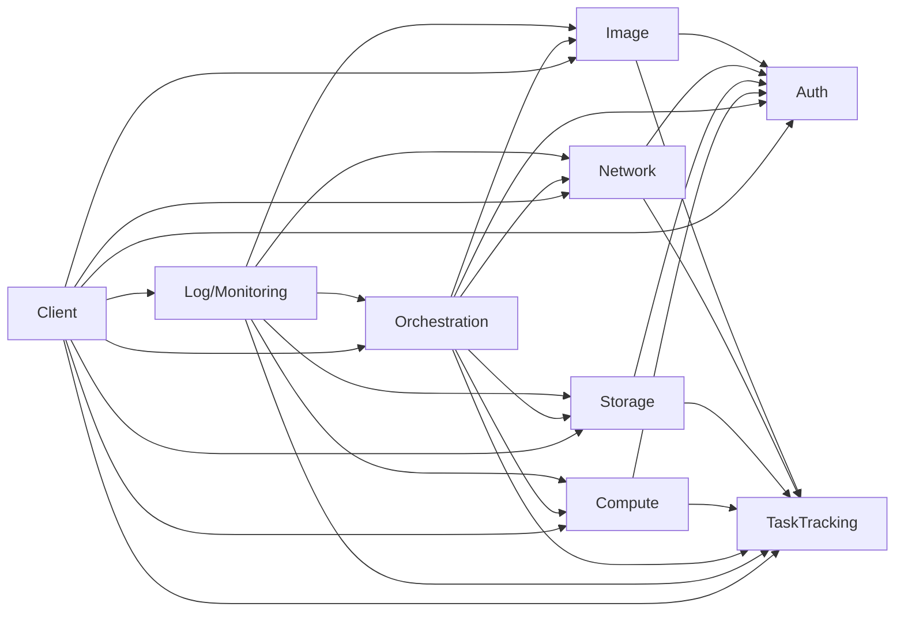

# 서버 가상화 제품 요구사항 명세 (초안)

본 문서는 고객/개발/테스트/운영/기술지원 등 이해관계자가 동일한 기준으로 논의할 수 있도록, **해결책이 아닌 목표(요구사항)** 를 중심으로 기술한다.  
구현 대안/제안은 **첨언**으로 분리하여 요구사항과 혼동되지 않게 한다.

---

## 0) 배경/제약(요구사항이 아니라 전제)

- 초기 하부 가상화/클라우드 제공자는 **OpenStack**을 기반으로 시작한다.
- **AWS/Azure 등 타 Hypervisor/클라우드 연동은 향후 확장** 대상으로 둔다.
- OpenStack의 자원 관리 기능을 **추상화**하여 **Microservice 기반**으로 제공한다.
- 인증/계정 관리는 OpenStack 기본 인증과 별도로, **AD(Active Directory) 기반**으로 구성한다.
- 서비스 간 통신은 **규격화된 REST API**로 통일한다.
- 요구사항은 **시스템 전체 요구사항**과 **서비스별 요구사항**을 분리해 관리한다.
- 시스템은 **멀티 테넌트(여러 조직 동시 관리)** 를 지원한다.

> 첨언: 본 문서는 현재 고객이 “생각나는대로” 제공한 항목을 구조화한 1차 초안이며, 용어/범위/수용 기준은 추가 인터뷰로 보완될 수 있다.

---

## 1) 기본 기능 요구사항 명세 (X=1)

아래 항목은 **시스템이 제공해야 하는 고유 기능**을 정의한다.  
번호는 `1.Y.Z` 체계로 관리하며, `1.0.Z`는 시스템 공통이다.

### 1.0 시스템 공통(전체 서비스에 공통 적용)

- **1.0.1** 시스템은 모든 기능/자원을 **테넌트(조직) 단위로 분리**하여 관리해야 한다.
- **1.0.2** 시스템은 사용자 요청에 대해 **권한이 허용된 테넌트 범위 내 자원만** 조회/조작할 수 있어야 한다.
- **1.0.3** 시스템은 각 Microservice 간 연동을 위해 **표준화된 REST API 규격(버전/에러/응답형식 포함)** 을 제공해야 한다.
- **1.0.4** 시스템은 OpenStack 기반 자원 관리 기능을 **제공자(Provider) 추상화 계층**을 통해 제공해야 하며, 향후 타 제공자를 **추가**할 수 있어야 한다.
- **1.0.5** 시스템은 하부 인프라(OpenStack 등)의 일시 장애/단절 상황에서도, 시스템 내부에서 관리하는 **자원 상태/할당 정보(진실의 원천)를 유지**할 수 있어야 한다.
- **1.0.6** 시스템은 하부 인프라와의 연결이 회복되면 **상태 불일치(드리프트)를 탐지**하고, 관리자가 확인 가능한 방식으로 **정합성 조치(동기화/복구)를 수행**할 수 있어야 한다.
- **1.0.7** 시스템은 장기 실행 작업을 “Task”로 관리하고, 사용자가 **진행상황/결과를 조회**할 수 있어야 한다.

> 첨언: 1.0.3의 “표준화”에는 보통 API 버전, pagination/filter, idempotency, 표준 에러코드/메시지, 상관관계 ID 등이 포함된다(범위 합의 필요).

### 1.1 인증/계정/권한(IAM, AD 기반) 서비스 요구사항

- **1.1.1** 시스템은 사용자 인증을 위해 **AD 기반 로그인**을 제공해야 한다.
- **1.1.2** 시스템은 계정 정보의 권위 데이터를 **AD로 간주**하고, 계정 생성/삭제/잠금/비밀번호 정책 등은 **AD 정책을 따른다**.
- **1.1.3** 시스템은 사용자/그룹(또는 조직) 정보를 기반으로 **테넌트 매핑**을 관리할 수 있어야 한다.
- **1.1.4** 시스템은 사용자에게 **역할/권한(RBAC)** 을 부여하고, API 호출 시 이를 **검증**해야 한다.
- **1.1.5** 시스템은 관리자에게 테넌트/역할/권한 정책을 **조회/관리**할 수 있는 기능을 제공해야 한다.
- **1.1.6** 시스템은 OpenStack의 인증/계정체계와 **독립적으로** 인증/인가를 수행해야 한다.

### 1.2 컴퓨트(Compute: CPU/Memory/VM) 서비스 요구사항

- **1.2.1** 시스템은 테넌트 단위로 가상머신(VM) 자원을 **생성**할 수 있어야 한다.
- **1.2.2** 시스템은 VM의 생명주기(예: **시작/정지/재시작/삭제**)를 제어할 수 있어야 한다.
- **1.2.3** 시스템은 VM 생성 시 필요한 컴퓨트 용량(CPU/Memory 등)을 **할당**하고, 할당 결과를 **추적**해야 한다.
- **1.2.4** 시스템은 VM의 현재 상태(예: running/stopped/error 등)를 **조회**할 수 있어야 한다.
- **1.2.5** 시스템은 테넌트(또는 사용자)별 컴퓨트 사용량/할당량을 **조회**할 수 있어야 한다.
- **1.2.6** 시스템은 VM과 네트워크/스토리지/이미지 자원의 연결 관계를 **조회**할 수 있어야 한다.

### 1.3 스토리지(Storage: Disk/Volume) 서비스 요구사항

- **1.3.1** 시스템은 테넌트 단위로 볼륨(Volume)을 **생성/삭제**할 수 있어야 한다.
- **1.3.2** 시스템은 볼륨을 VM에 **연결/해제(attach/detach)** 할 수 있어야 한다.
- **1.3.3** 시스템은 볼륨의 상태(available/in-use/error 등)를 **조회**할 수 있어야 한다.
- **1.3.4** 시스템은 스토리지의 **성능 등급(티어) 및 타입**에 따라 볼륨을 **구분/관리**할 수 있어야 한다.
- **1.3.5** 시스템은 테넌트별 스토리지 사용량/할당량을 **조회**할 수 있어야 한다.

### 1.4 네트워크(Network) 서비스 요구사항

- **1.4.1** 시스템은 테넌트 단위로 네트워크 자원(네트워크/서브넷 등)을 **생성/삭제/조회**할 수 있어야 한다.
- **1.4.2** 시스템은 VM에 네트워크 연결(NIC 등)을 **구성/변경**할 수 있어야 한다.
- **1.4.3** 시스템은 VM의 네트워크 연결 정보(예: IP, 연결된 네트워크)를 **조회**할 수 있어야 한다.
- **1.4.4** 시스템은 네트워크 자원 할당 상태를 **유지/추적**할 수 있어야 한다(하부 인프라 상태와 무관하게 관리 관점의 할당정보 유지).

### 1.5 가상머신 이미지(Image) 서비스 요구사항

- **1.5.1** 시스템은 VM 이미지의 **등록/조회/삭제**를 제공해야 한다.
- **1.5.2** 시스템은 이미지별 메타데이터를 **관리**할 수 있어야 한다.
- **1.5.3** 시스템은 “접속에 필요한 네트워크 연결 정보”를 **이미지와 VM 인스턴스에 저장**하고 조회할 수 있어야 한다.
- **1.5.4** 시스템은 저장된 접속정보를 기반으로 사용자가 VM에 **접속을 수행**할 수 있도록 필요한 정보를 제공해야 한다.

### 1.6 오케스트레이션(Orchestration) 서비스 요구사항

- **1.6.1** 시스템은 사용자가 여러 서비스를 순차 호출하지 않아도, **업무 단위(예: VM+네트워크+볼륨 구성)** 로 실행되는 오케스트레이션 기능을 제공해야 한다.
- **1.6.2** 시스템은 오케스트레이션 실행 결과로 생성/변경된 자원들을 **일관된 단위로 추적**할 수 있어야 한다.
- **1.6.3** 시스템은 오케스트레이션 중 일부 단계 실패 시, 사용자/관리자가 **실패 지점과 원인**을 확인할 수 있어야 한다.
- **1.6.4** 시스템은 오케스트레이션 실행을 **재시도/중단/롤백(가능한 범위 내)** 할 수 있어야 한다.

> 첨언: “롤백”의 범위(완전 복구 vs 부분 복구)는 서비스/자원별 기술 제약이 달라 별도 합의가 필요하다.

### 1.7 Task(작업) 상태/결과 조회 서비스 요구사항

- **1.7.1** 시스템은 장기 실행 작업(자원 생성/삭제/오케스트레이션 등)을 **Task로 생성**해 관리해야 한다.
- **1.7.2** 시스템은 Task의 상태(대기/진행/성공/실패/취소 등)와 **진행률 또는 단계 정보**를 조회할 수 있어야 한다.
- **1.7.3** 시스템은 Task의 수행 결과(생성된 자원 ID, 오류 코드/메시지 등)를 **조회**할 수 있어야 한다.
- **1.7.4** 시스템은 사용자가 자신 권한 범위 내 Task만 **조회**할 수 있도록 제한해야 한다.
- **1.7.5** 시스템은 관리자가 테넌트 단위로 Task를 **검색/조회**할 수 있어야 한다.

### 1.8 사용자 접속/접근(Access) 서비스 요구사항

- **1.8.1** 시스템 사용자는 로그인 후, 자신에게 권한이 있는 VM의 **목록을 조회**할 수 있어야 한다.
- **1.8.2** 시스템 사용자는 VM 선택 시, 해당 VM의 **접속 가능 정보(경로/방식/대상)** 를 확인할 수 있어야 한다.
- **1.8.3** 시스템은 이미지/VM에 저장된 접속정보를 기반으로, 사용자가 VM에 **접속을 수행**할 수 있도록 해야 한다.
- **1.8.4** 시스템은 VM 접근 경로를 **ZTNA 기술을 통해 제공**할 수 있어야 한다.

### 1.9 ZTNA 관제(통제/감시) 서비스 요구사항

- **1.9.1** 시스템은 ZTNA를 통한 네트워크 접근을 **정책 기반으로 제어**할 수 있어야 한다.
- **1.9.2** 시스템은 ZTNA 접근 세션(누가/언제/어떤 VM에/어떤 방식으로)에 대한 **가시성(조회)** 을 제공해야 한다.
- **1.9.3** 시스템 관리자는 ZTNA 접근에 대해 **허용/차단/종료 등 통제 기능**을 수행할 수 있어야 한다.
- **1.9.4** 시스템은 ZTNA 접근 이벤트를 **감사 가능한 형태로 기록**해야 한다.

### 1.10 Web 기반 관리콘솔(Admin Console) 요구사항

- **1.10.1** 시스템 관리자는 Web 기반 관리콘솔을 통해 시스템 기능을 **수행**할 수 있어야 한다.
- **1.10.2** 관리콘솔은 테넌트/사용자/권한(IAM) 관리 기능을 **제공**해야 한다.
- **1.10.3** 관리콘솔은 자원(컴퓨트/네트워크/스토리지/이미지)의 **조회/생성/변경/삭제** 기능을 제공해야 한다(권한 범위 내).
- **1.10.4** 관리콘솔은 오케스트레이션 실행 및 Task 진행상황/결과를 **조회**할 수 있어야 한다.
- **1.10.5** 관리콘솔은 통합 로그 조회 기능을 **제공**해야 한다.

### 1.11 통합 로그(수집/조회) 서비스 요구사항

- **1.11.1** 시스템은 각 Microservice에서 발생한 로그를 **통합 수집**할 수 있어야 한다.
- **1.11.2** 시스템은 로그를 테넌트/서비스/시간/상관관계 기준으로 **검색/조회**할 수 있어야 한다.
- **1.11.3** 시스템은 장애 분석을 위해 요청 단위의 **연관 로그 추적(상관관계)** 이 가능해야 한다.
- **1.11.4** 시스템은 로그 보관/조회에 대해 테넌트 및 관리자 권한에 따른 **접근 통제**가 가능해야 한다.

---

## 2) 외부 기능 요구사항 명세 (X=2)

아래 항목은 모니터링/운영/가시성/보안/감사 등 **기본 기능 외 추가로 필요한 요구사항**을 정의한다.

### 2.0 운영/가시성 공통

- **2.0.1** 시스템은 각 서비스의 상태를 확인할 수 있는 **헬스/상태 점검 수단**을 제공해야 한다.
- **2.0.2** 시스템은 서비스별 주요 지표(예: 요청수, 오류율, 지연시간, Task 처리량)를 **수집/조회**할 수 있어야 한다.
- **2.0.3** 시스템은 장애 원인 분석을 위해 요청 단위의 **추적 정보(Trace/Correlation)** 를 제공해야 한다.
- **2.0.4** 시스템은 설정값(연동 엔드포인트, 정책 등)을 운영자가 **변경/적용/이력관리**할 수 있어야 한다.

### 2.1 보안/감사

- **2.1.1** 시스템은 인증/권한 변경, 자원 생성/삭제, 접근(ZTNA 포함)과 같은 주요 행위를 **감사로그로 남겨야** 한다.
- **2.1.2** 시스템은 테넌트 간 데이터/로그가 **논리적으로 완전 분리**되도록 보호해야 한다.
- **2.1.3** 시스템은 서비스 간 API 호출에 대해 **인증/인가 및 무결성 보호** 요구를 충족해야 한다.

### 2.2 가용성/복구(하부 인프라와 무관하게 상태 유지)

- **2.2.1** 시스템은 하부 인프라 연동 실패 시에도, 내부 관리 데이터(자원/할당/Task 상태)를 **손실 없이 유지**해야 한다.
- **2.2.2** 시스템은 연동 복구 후 자원 정합성 확인을 위한 **점검/동기화 절차**를 제공해야 한다.

### 2.3 로그 운영

- **2.3.1** 시스템은 통합 로그에 대해 **보관기간/삭제 정책**을 설정할 수 있어야 한다.
- **2.3.2** 시스템은 로그 조회 성능/권한 정책을 운영자가 관리할 수 있어야 한다.

---

## 3) 테스트 요구사항 명세 (X=3)

아래 항목은 기본 기능(1.*)과 외부 기능(2.*)을 검증하기 위한 **테스트 요구사항**을 정의한다.

- **3.0.1** 테스트 명세에는 최소 **단위 테스트(Unit Test), 통합 테스트(Integration Test), 시나리오 테스트(E2E)** 요구사항이 포함되어야 한다.
- **3.0.2** 각 기본 기능/외부 기능 요구사항(1.* / 2.*)은 테스트 항목(3.*)과 **추적 가능(Traceability)** 해야 한다.
- **3.0.3** 개발자는 자신이 개발한 서비스의 기능 요구사항에 대해 **최소 단위 테스트를 수행**해야 하며, 수행 여부가 확인 가능해야 한다.
- **3.0.4** 통합 테스트는 서비스 간 REST API 연동(예: 오케스트레이션↔컴퓨트/네트워크/스토리지, IAM↔각 서비스 권한검증, 로그↔각 서비스)을 포함해야 한다.
- **3.0.5** E2E 시나리오 테스트는 사용자 관점의 핵심 흐름(예: 로그인→VM 생성 오케스트레이션→Task 조회→VM 목록/접속→ZTNA 경유 접근→로그/감사 확인)을 포함해야 한다.
- **3.0.6** 하부 인프라 장애/복구 상황(연동 실패/복구)에 대한 시나리오 테스트를 포함해야 한다. (1.0.5~1.0.6, 2.2.* 대응)

---

## 부록 A) 확인 질문(요구사항 확정을 위한 추가 정보)

- 멀티 테넌트 모델에서 “조직(tenant)” 아래에 프로젝트/그룹 같은 **하위 단위**가 필요한가?
- “이미지/VM에 저장할 접속정보”에 포함될 항목(프로토콜/포트/계정/게이트웨이 등)의 **정의/범위**는?
- ZTNA 범위가 “접속 경로 제공”만인지, “세션 레코딩/승인 워크플로우”까지 포함인지?
- 관리콘솔이 “관리자 전용”과 “일반 사용자 포털”을 분리할지, 권한 기반 단일 UI로 갈지?

